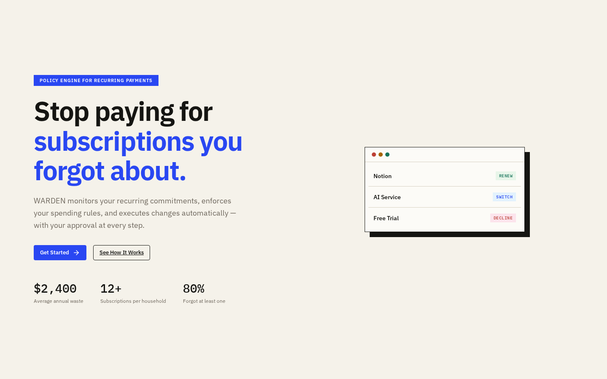

<p align="center">
  
</p>

<h1 align="center">WARDEN</h1>

<p align="center">
  <strong>AI Agent That Enforces Your Spending Policy</strong>
</p>

<p align="center">
  Stop paying for subscriptions you forgot about. WARDEN monitors your recurring commitments,<br>
  enforces your spending rules, and completes transactions automatically — with your approval.
</p>

<p align="center">
  <a href="#quick-start">Quick Start</a> ·
  <a href="#features">Features</a> ·
  <a href="#how-it-works">How It Works</a> ·
  <a href="#api">API</a> ·
  <a href="#submission">Submission</a>
</p>

---

## The Problem

The average household has **12+ active subscriptions** and wastes **$2,400/year** on forgotten or unused services. Current solutions show you what you're paying for but don't take action.

**WARDEN changes that.** It's not a dashboard — it's an agent that discovers, decides, and completes transactions.

---

## The Solution

<p align="center">
  
</p>

WARDEN is a **policy engine for recurring commitments**. Write spending rules in plain English, and an AI agent:

1. **Discovers** your subscriptions
2. **Analyzes** each against your rules
3. **Recommends** actions (renew, downgrade, cancel)
4. **Completes** transactions via Prava
5. **Verifies** with an auditable evidence ledger

---

## Pitch Lines

> **One-liner:** "WARDEN is an AI agent that enforces your spending policy across all subscriptions."

> **Elevator pitch:** "You write the rules. WARDEN enforces them. Never overpay again."

> **Demo hook:** "Watch an AI agent analyze $87/month in subscriptions, find $35 in savings, and complete the transaction — all with your approval."

> **Technical pitch:** "A policy engine that compiles natural language rules into enforceable constraints, executes them through Prava's payment infrastructure, and records every action in a hash-chained evidence ledger."

> **Judges pitch:** "We built the trust layer for agentic commerce — an agent that handles money safely, transparently, and with user approval at every step."

---

## Features

| Feature | Description |
|---------|-------------|
| **Policy Engine** | Write rules in natural English. WARDEN compiles them into enforceable constraints. |
| **AI Reasoning** | OpenAI GPT-4.1 analyzes subscriptions against your policy. |
| **Prava Integration** | Real sandbox transactions with passkey authentication. |
| **Evidence Ledger** | Hash-chained audit trail of every action taken. |
| **Real-time Updates** | SSE-powered live event streaming. |
| **Keyboard Shortcuts** | Cmd+K command palette for power users. |

---

## How It Works

```
┌─────────────────────────────────────────────────────────────┐
│                    YOUR SPENDING RULES                      │
│  "Never spend more than $60/month. Cancel unused after 30d" │
└─────────────────────────────────────────────────────────────┘
                              │
                              ▼
┌─────────────────────────────────────────────────────────────┐
│                   WARDEN AGENT                              │
│  1. Scans your subscriptions                                │
│  2. Analyzes against policy                                 │
│  3. Recommends: RENEW / SWITCH / DECLINE                    │
│  4. You approve → Agent executes via Prava                  │
└─────────────────────────────────────────────────────────────┘
                              │
                              ▼
┌─────────────────────────────────────────────────────────────┐
│                   EVIDENCE LEDGER                           │
│  Hash-chained, auditable record of every transaction        │
└─────────────────────────────────────────────────────────────┘
```

---

## Quick Start

```bash
# Clone
git clone git@github.com:Varun-ai07/WARDEN.git
cd WARDEN

# Install
npm install

# Configure
cp .env.example .env
# Edit .env with your API keys

# Run
npm run dev
```

Open `http://localhost:5173` and click **Get Started**.

### Environment Variables

```bash
# Required
OPENAI_API_KEY=sk-...           # For AI reasoning
PRAVA_API_KEY=sk_test_...       # For payment processing
PRAVA_PUBLISHABLE_KEY=pk_test_...

# Optional
REASONER_MODE=openai            # or "fake" for simulation
PAYMENT_PROVIDER_MODE=prava     # or "fake" for simulation
```

---

## Tech Stack

| Layer | Technology |
|-------|------------|
| Frontend | React, Vite, Tailwind CSS |
| Backend | Express.js, TypeScript |
| Database | SQLite |
| AI | OpenAI GPT-4.1 |
| Payments | Prava SDK/API |
| Auth | Passkey (WebAuthn) |

---

## API Endpoints

| Method | Path | Description |
|--------|------|-------------|
| GET | `/api/v1/health` | Health check |
| GET | `/api/v1/session` | Get session |
| POST | `/api/v1/runs` | Create run |
| POST | `/api/v1/decisions/:id/approval-session` | Start approval |
| POST | `/api/v1/prava/sessions/:id/finalize` | Complete transaction |

---

## Project Structure

```
WARDEN/
├── apps/
│   ├── api/                 # Express backend
│   │   └── src/
│   │       ├── app.ts       # Routes
│   │       ├── service.ts   # Business logic
│   │       ├── prava-provider.ts  # Prava integration
│   │       └── reasoner.ts  # AI reasoning
│   └── web/                 # React frontend
│       └── src/
│           ├── App.tsx      # Dashboard
│           ├── Landing.tsx  # Landing page
│           └── api.ts       # API client
├── packages/
│   └── shared/              # Shared types
└── artifacts/               # Screenshots
```

---

## Screenshots

<p align="center">
  
  &nbsp;&nbsp;
  
</p>

---

## Submission

**Hackathon:** Agentic Commerce Hackathon 2026
**Team:** Solo builder
**Built during:** August 1-2, 2026

### What Existed Before
Nothing. This project was built from scratch during the hackathon.

### What We Learned
- Agentic commerce requires clear transaction completion proof
- Users need to understand what the agent is doing at every step
- Policy engines are a novel approach to subscription management
- Prava's passkey flow provides the right trust boundary for AI payments

---

## License

MIT

---

<p align="center">
  Built with ❤️ for the Agentic Commerce Hackathon 2026
</p>
